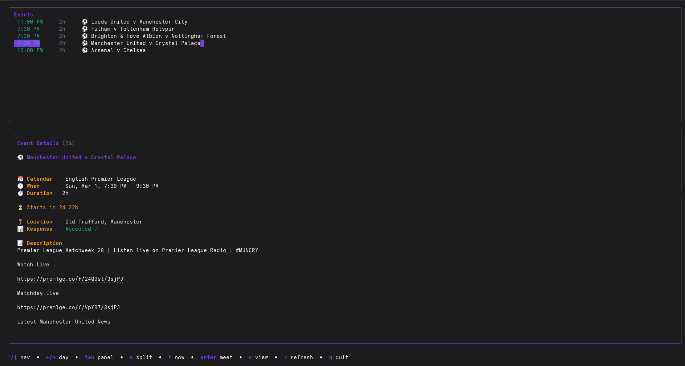

# tsk

A terminal calendar client for people who'd rather not deal with calendars.

**tsk** — part "task", part the sound you make when yet another meeting invite lands in your inbox.

---

It's a CLI tool that pulls events from multiple calendar providers (starting with Google) and shows them in your terminal. Because sometimes you just want to see what's eating your day without opening a browser, signing into three accounts, and getting distracted by 47 unread emails.

Works with your primary calendar, shared calendars, subscribed calendars (holidays, team schedules), and all those calendars you forgot you subscribed to.

## Google Calendar

To hook up your Google account:

```bash
tsk auth
```

This opens a browser, you click through Google's OAuth flow, and you're done. Tokens are saved locally so you don't have to do this dance every time.

If you're running this on a headless server or just hate browsers, there's a `--manual` flag that gives you a URL to paste instead.

## Usage

```bash
# What's on the calendar?
tsk

# What's next?
tsk next

# Just the next 3 days
tsk --days 3

# This week
tsk --from monday --to friday

# Hide the OOO noise
tsk --ooo=false

# Smart mode: if you're OOO, hide everything else
tsk --smart-ooo

# What calendars do I even have?
tsk calendars
```

## Interactive Mode

For when you want to actually browse your calendar like a normal person:

```bash
tsk ui
```

This gives you a proper TUI with:
- Event list on the left, details on the right
- Navigate with arrow keys or vim bindings (`j/k`, `h/l`)
- Jump between days, see what's coming up
- Open meeting links directly (`o` or Enter)
- A "NOW" marker so you know where you are in your day
- Past events dimmed out so you can focus on what's ahead



## Profiles

Different views for different moods:

```bash
# Work account, all the details
tsk -p work

# Just today's meetings, minimal output
tsk -p today

# Only actual meetings, no focus time or OOO
tsk -p meetings
```

Set up profiles in `~/.config/tsk/config.yaml`. Each profile can have its own credentials (for multiple accounts), filters, and display preferences.

```bash
# List profiles
tsk profile list

# Add a new one
tsk profile add personal --credentials-file ~/.config/tsk/personal_creds.json

# See what a profile looks like
tsk profile show work
```

## Config

Copy `config.example.yaml` to `~/.config/tsk/config.yaml` and tweak to taste. Everything's optional — sensible defaults if you don't bother.

---

Still early days. More providers coming eventually. Maybe Outlook. Maybe iCloud. We'll see.


<!-- TODO:
1. Respond to events
2. Create new events
3. Duplicate events in shared calendar, view them as a single event with calendars listed? and show the responses for each of the calendars
-->