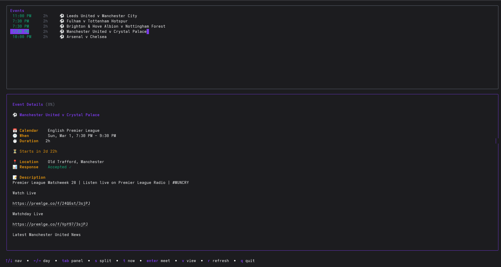

# tsk

A terminal calendar client for people who'd rather not deal with calendars.

**tsk** — part "task", part the sound you make when yet another meeting invite lands in your inbox.



---

It's a CLI tool that pulls events from Google Calendar and Outlook Calendar and shows them in your terminal. Because sometimes you just want to see what's eating your day without opening a browser, signing into three accounts, and getting distracted by 47 unread emails.

> tsk can view and manage your calendar events, but can't delete calendars or modify calendar settings. Your calendar structure stays intact. (Whether you consider that reassuring or limiting is up to you.)

Works with your primary calendar, shared calendars, subscribed calendars (holidays, team schedules), and all those calendars you forgot you subscribed to.

## Install

```bash
go install github.com/theakshaypant/tsk/cmd/tsk@latest
```

Make sure `$GOPATH/bin` is in your `PATH` — then `tsk` is ready to go.

## Quick Start

Authenticate with your calendar provider, then run it:

```bash
tsk auth                   # Google Calendar (default)
tsk -p outlook auth        # Outlook / Office 365
```

Provider setup guides: [Google](docs/google_setup.md) | [Outlook](docs/outlook_setup.md)

### What's next?

```bash
tsk next
```

Shows your next upcoming event with a countdown. If you've double-booked yourself, it catches the conflict and shows all concurrent events.

### Respond to invitations

```bash
tsk respond primary:abc123 --accept
tsk respond primary:abc123 --decline -m "Sorry, conflict!"
tsk respond primary:abc123 --tentative --propose "14:00/15:00"
```

Accept, decline, or tentatively respond to calendar event invitations directly from the CLI. Optionally add a message or propose a new time. Enable `display.id: true` in your config to see event IDs.

[Full documentation](docs/usage.md#tsk-respond)

### Interactive mode

```bash
tsk ui
```

A proper TUI with an event list and detail panel, day-by-day navigation, a "NOW" marker that auto-scrolls to where you are, meeting link shortcuts, and merged duplicates across shared calendars. Quick-accept invitations with `a` or open the full respond modal with `r` to decline, go tentative, add messages, or propose new times.

## Documentation

Commands, flags, profiles, configuration, TUI keybindings, environment variables — it's all in the [CLI & Configuration Reference](docs/usage.md).

---

Still early days. Half-baked ideas and optimistic plans live in the [repo issues](https://github.com/theakshaypant/tsk/issues) — no promises, but they're fun to think about.
